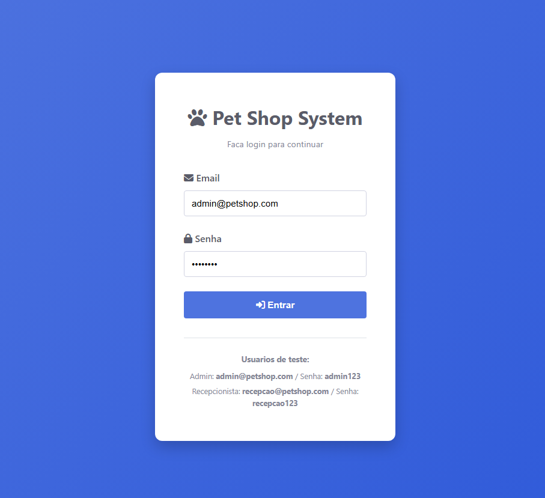
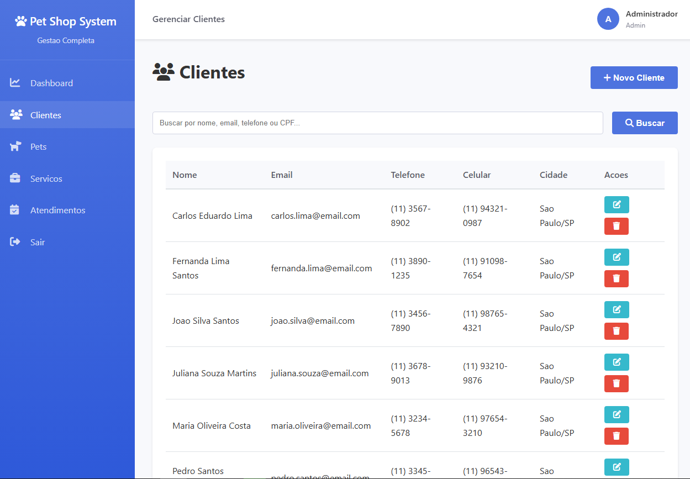
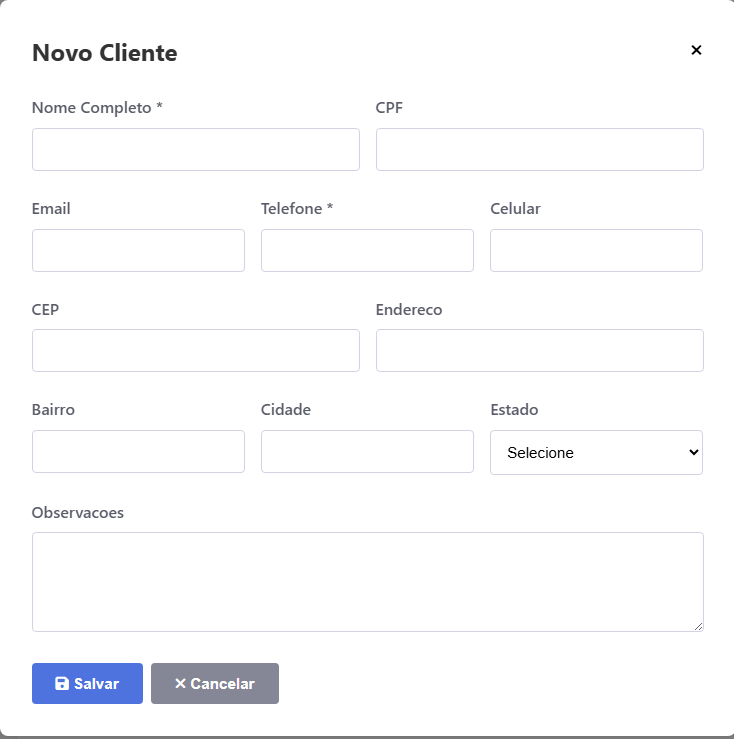
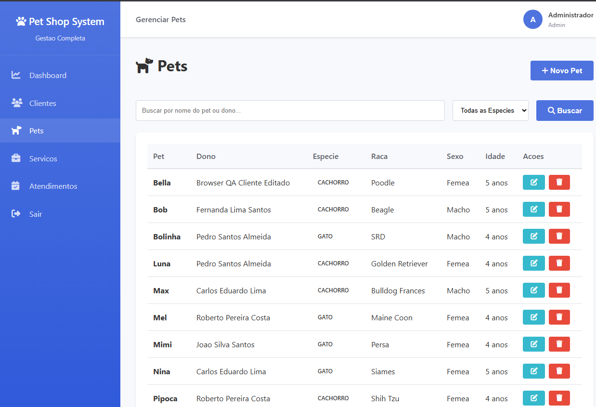
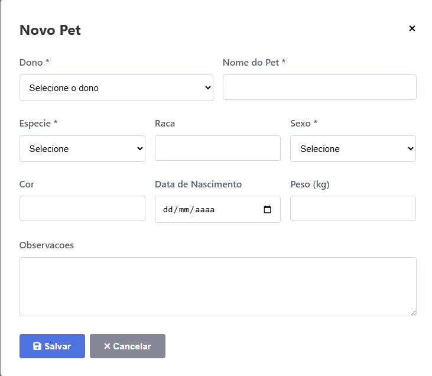
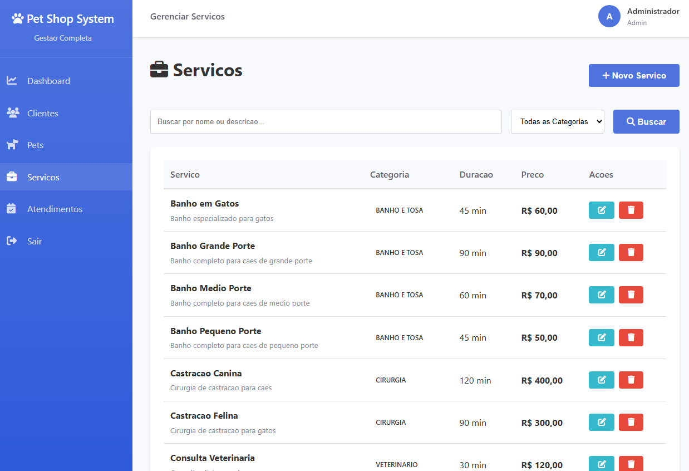
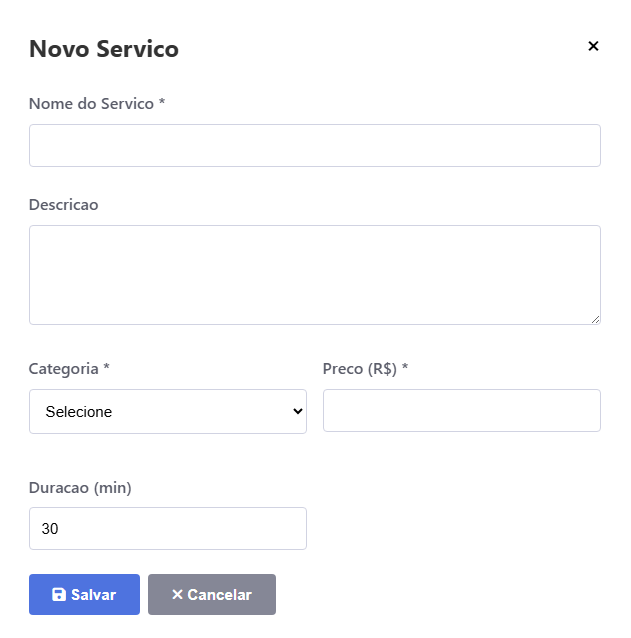
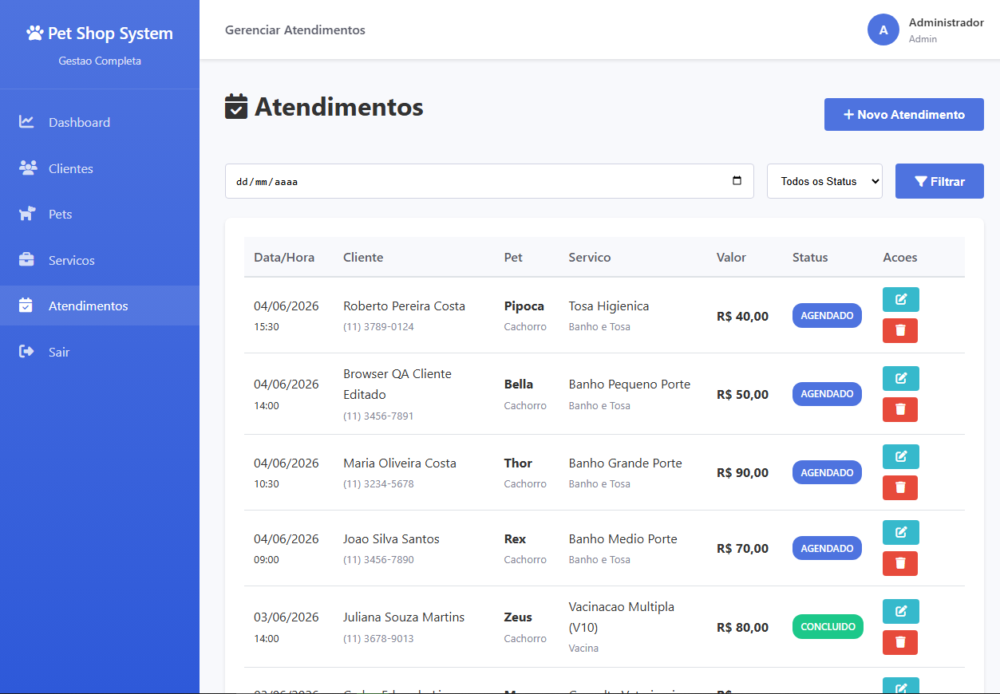
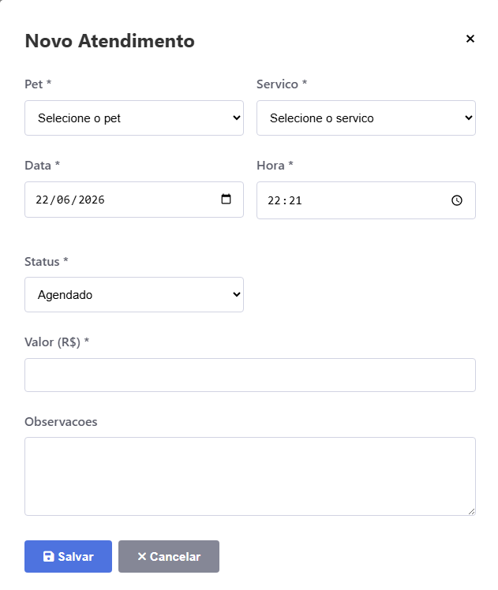

# PetShop System V2

[](https://www.php.net/)
[](https://www.mysql.com/)
[](https://developer.mozilla.org/pt-BR/docs/Web/HTML)
[](https://developer.mozilla.org/pt-BR/docs/Web/CSS)
[](https://developer.mozilla.org/pt-BR/docs/Web/JavaScript)
[](https://www.chartjs.org/)
[](https://fontawesome.com/)

Sistema Web de gestão operacional para petshops e clínicas veterinárias, desenvolvido em PHP procedural com MySQL/MariaDB !

## 📖 Sobre o projeto

### Status do projeto

A **V2 está estável e finalizada** e permanece pública no GitHub como referência técnica.

O projeto não possui demonstração online ativa nem previsão de retorno do deploy.

Uma nova versão em Laravel será desenvolvida separadamente, com arquitetura e estrutura modernizadas.

### Objetivo do projeto

O sistema foi desenvolvido a partir de necessidades observadas em um ambiente real de petshop. A versão pública utiliza dados demonstrativos/fictícios e sanitizados para preservar a privacidade dos dados originais.

O projeto está preparado para:

- Apresentação em portfólio;
- Publicação no GitHub;
- Execução local com XAMPP.

### Problema solucionado

A rotina de petshops e clínicas veterinárias envolve o gerenciamento de clientes, pets, serviços e atendimentos relacionados entre si.

Quando essas informações são controladas de forma fragmentada, surgem problemas como:

- Dificuldade para localizar o histórico de clientes e pets;
- Perda de informações sobre atendimentos;
- Falta de padronização nos status da agenda;
- Baixa visibilidade sobre serviços realizados e faturamento;
- Excesso de etapas durante o atendimento na recepção.

O PetShop System V2 centraliza essas operações em um único sistema, com um fluxo direto:

**cliente → pet → serviço → atendimento → acompanhamento no dashboard**

## ✨ Funcionalidades

| Módulo | Funcionalidades |
| --- | --- |
| Autenticação | Login, logout e identificação dos perfis administrador e recepcionista |
| Clientes | Cadastro, consulta, edição, pesquisa e desativação |
| Pets | Cadastro vinculado ao cliente, edição, filtros e desativação |
| Serviços | Cadastro de preço, duração, categoria, edição, filtros e desativação |
| Atendimentos | Agendamento, edição, exclusão, observações e controle de status |
| Dashboard | Indicadores operacionais, faturamento e gráficos |
| Filtros | Pesquisa por texto, espécie, categoria, data e status |
| Ferramentas de desenvolvimento | Scripts auxiliares para instalação, conexão e testes funcionais |

Os atendimentos podem utilizar os seguintes status:

- Agendado;
- Em Atendimento;
- Concluído;
- Cancelado.

## 🖼️ Screenshots

### Dashboard


### Login



### Clientes



### Novo Cliente



### Pets



### Novo Pet



### Serviços



### Novo Serviço



### Atendimentos



### Novo Atendimento



## 🚀 Tecnologias

- **Backend:** PHP procedural
- **Acesso ao banco:** MySQLi
- **Banco de dados:** MySQL ou MariaDB
- **Frontend:** HTML5, CSS3 e JavaScript
- **Gráficos:** Chart.js
- **Ícones:** Font Awesome
- **Codificação:** UTF-8 e `utf8mb4`
- **Ambiente local recomendado:** Windows com XAMPP
- **Servidor web:** Apache

### Segurança aplicada

A V2 inclui medidas de segurança aplicadas ao contexto de uma aplicação PHP procedural:

- armazenamento de senhas com `password_hash()`;
- validação de senhas com `password_verify()`;
- consultas preparadas para entradas variáveis;
- escape de saída HTML com `htmlspecialchars()`;
- tokens CSRF nos formulários;
- comparação segura de tokens com `hash_equals()`;
- regeneração do identificador da sessão após o login;
- cookies de sessão com `HttpOnly` e `SameSite=Lax`;
- modo estrito de sessão;
- bloqueio de páginas internas para usuários não autenticados;
- mensagens de erro de banco sem exposição direta de credenciais;
- bloqueio de acesso web às pastas `config`, `scripts` e `sql` pelo `.htaccess`;
- cabeçalhos HTTP básicos de proteção via Apache, quando o módulo de headers está habilitado.

Em produção, o atributo `Secure` do cookie de sessão é ativado quando a aplicação é acessada por HTTPS.

> As medidas existentes reduzem riscos comuns, como SQL Injection, XSS, CSRF, exposição de arquivos internos e uso inseguro de sessões. Elas não substituem a configuração segura do servidor e da hospedagem.

### Aprendizados técnicos

O desenvolvimento da V2 consolidou práticas importantes para aplicações PHP procedurais:

- Organização modular sem substituição da arquitetura existente;
- Uso consistente de consultas preparadas;
- Proteção de formulários com tokens CSRF;
- Gerenciamento mais seguro de sessões;
- Escape de dados na saída HTML;
- Manutenção de relacionamentos entre clientes, pets e atendimentos;
- Uso de desativação lógica para preservar referências históricas;
- Padronização de banco e aplicação em UTF-8/`utf8mb4`;
- Separação entre código da aplicação e ferramentas de desenvolvimento;
- Criação de testes funcionais para os fluxos críticos;
- Sanitização de dados antes da publicação;
- Configuração da aplicação para ambientes diferentes por variáveis de ambiente.

A evolução da V1 para a V2 teve como foco estabilidade, segurança, organização e previsibilidade operacional, mantendo a implementação em PHP procedural.

## ⚙️ Como executar

### Requisitos

- PHP 7.4 ou superior (recomenda-se uma versão mais recente);
- MySQL 5.7+, MariaDB ou versão compatível;
- Apache;
- extensão MySQLi habilitada;
- XAMPP recomendado para execução local no Windows.

### Instalação local com XAMPP

1. Clone o repositório ou copie o projeto para o diretório do Apache:

   ```powershell
   Copy-Item ".\Petshopsystemv2" "C:\xampp\htdocs\" -Recurse -Force
   ```

2. Inicie o Apache e o MySQL pelo XAMPP Control Panel.

3. Crie e configure o banco conforme a seção seguinte.

4. Acesse:

   ```text
   http://localhost/Petshopsystemv2/
   ```

### Configuração do arquivo de banco

O arquivo `config/database.php` contém os dados reais de conexão com o banco e não deve ser versionado.

O repositório público mantém apenas o modelo seguro:

```text
config/database.example.php
```

Para configurar o projeto, copie o modelo:

```powershell
Copy-Item ".\config\database.example.php" ".\config\database.php"
```

Depois preencha `config/database.php` com os dados reais apenas no ambiente local ou no servidor. Nunca envie credenciais reais para o GitHub.

### Configuração para ambiente de hospedagem

A aplicação aceita as seguintes variáveis de ambiente:

```env
APP_ENV=production
BASE_URL=https://seu-dominio.example/
DB_HOST=localhost
DB_USER=seu_usuario
DB_PASS=sua_senha
DB_NAME=seu_banco
```

O arquivo `.env.example` funciona como referência. A aplicação lê as variáveis disponibilizadas pelo ambiente do servidor PHP; ela não carrega automaticamente um arquivo `.env`.

Caso a hospedagem não ofereça configuração de variáveis de ambiente, defina os valores diretamente em `config/database.php` durante a publicação e mantenha esse arquivo fora do Git. O arquivo público para referência é `config/database.example.php`.

Antes de publicar:

- utilize HTTPS;
- use um usuário de banco dedicado, sem privilégios de administrador;
- configure corretamente a `BASE_URL`;
- não publique credenciais reais;
- não versione `config/database.php`;
- altere as senhas dos usuários demonstrativos;
- mantenha `config/`, `scripts/` e `sql/` fora do acesso público;
- confirme que as regras do `.htaccess` são respeitadas pelo servidor;
- desative a listagem de diretórios;
- mantenha logs, backups, sessões e arquivos temporários fora do repositório.

### Configuração do banco

#### Importação pelo phpMyAdmin

1. Acesse `http://localhost/phpmyadmin`.
2. Crie o banco `petshop_system`.
3. Utilize codificação `utf8mb4`.
4. Abra a aba **Importar**.
5. Selecione:

   ```text
   sql/database.sql
   ```

6. Execute a importação.

#### Importação pela linha de comando

No PowerShell:

```powershell
cmd.exe /c '"C:\xampp\mysql\bin\mysql.exe" -u root -e "CREATE DATABASE IF NOT EXISTS petshop_system CHARACTER SET utf8mb4 COLLATE utf8mb4_unicode_ci;"'

cmd.exe /c '"C:\xampp\mysql\bin\mysql.exe" -u root petshop_system < "C:\xampp\htdocs\Petshopsystemv2\sql\database.sql"'
```

Caso o usuário MySQL possua senha, adicione `-p` e informe a senha quando solicitado.

#### Configuração padrão para desenvolvimento

A configuração local padrão utiliza:

```text
Host: localhost
Usuário: root
Senha: vazia
Banco: petshop_system
```

Esses valores podem ser substituídos pelas variáveis:

- `DB_HOST`;
- `DB_USER`;
- `DB_PASS`;
- `DB_NAME`;
- `BASE_URL`;
- `APP_ENV`.

#### Usuários demonstrativos

O banco público inclui contas fictícias para avaliação local:

| Perfil | E-mail | Senha |
| --- | --- | --- |
| Administrador | `admin@petshop.com` | `admin123` |
| Recepcionista | `recepcao@petshop.com` | `recepcao123` |

> Essas credenciais são exclusivamente demonstrativas. Em um ambiente de produção real, altere ou remova essas contas antes de disponibilizar a aplicação.

### Testes

#### Verificação da conexão

Para verificar a conexão e a existência das tabelas obrigatórias:

```powershell
& php ".\scripts\dev\test_db.php"
```

Caso o PHP não esteja disponível no `PATH`, utilize:

```powershell
& "C:\xampp\php\php.exe" ".\scripts\dev\test_db.php"
```

#### Teste funcional automatizado

O projeto inclui um script PowerShell que utiliza um banco isolado para validar:

- login como administrador;
- login como recepcionista;
- logout;
- CRUD de clientes;
- CRUD de pets;
- CRUD de serviços;
- CRUD de atendimentos;
- dashboard;
- filtros;
- proteção CSRF;
- bloqueio de páginas privadas;
- atributos do cookie de sessão.

Execute o teste:

```powershell
powershell -ExecutionPolicy Bypass -File ".\scripts\dev\functional_test.ps1"
```

Por padrão, o teste utiliza o banco:

```text
petshop_system_v2_test
```

Crie esse banco e importe `sql/database.sql` antes da execução.

> Execute o teste funcional apenas em um banco isolado. O script cria, altera e remove registros durante a validação.

#### Verificação manual recomendada

1. Entre com um usuário demonstrativo.
2. Cadastre um cliente.
3. Cadastre um pet vinculado ao cliente.
4. Cadastre ou selecione um serviço.
5. Crie um atendimento.
6. Atualize o status do atendimento.
7. Confira os indicadores no dashboard.
8. Teste os filtros dos módulos.
9. Finalize a sessão.
10. Tente acessar uma página interna sem login e confirme o redirecionamento.

## 📂 Estrutura do projeto

```text
Petshopsystemv2/
├── assets/
│   ├── css/
│   │   └── style.css
│   └── js/
│       └── main.js
├── config/
│   ├── config.php
│   ├── database.example.php
│   └── database.php
├── includes/
│   ├── footer.php
│   └── header.php
├── pages/
│   ├── atendimentos.php
│   ├── clientes.php
│   ├── dashboard.php
│   ├── login.php
│   ├── logout.php
│   ├── pets.php
│   └── servicos.php
├── scripts/
│   └── dev/
│       ├── auto_setup.ps1
│       ├── functional_test.ps1
│       ├── reset_passwords.php
│       └── test_db.php
├── sql/
│   └── database.sql
├── .env.example
├── .htaccess
├── index.php
└── README.md
```

### Responsabilidades principais

- `assets/`: estilos e scripts da interface;
- `config/`: configurações gerais, sessão e conexão com o banco;
- `includes/`: componentes compartilhados da interface;
- `pages/`: módulos funcionais da aplicação;
- `scripts/dev/`: ferramentas auxiliares de desenvolvimento e testes;
- `sql/`: estrutura do banco e dados demonstrativos.

## 🌐 Deploy

Deploy removido pois irei atualizar o projeto para versão V3 e deixar novamente hospedado

Uma nova versão em Laravel será desenvolvida separadamente, com arquitetura e estrutura próprias.

## 👤 Autor

**Natan Da Luz**

- E-mail: [natandaluz01@gmail.com](mailto:natandaluz01@gmail.com)
- LinkedIn: [linkedin.com/in/natandaluz](https://www.linkedin.com/in/natandaluz/)
- Portfólio: [portfolionatan.vercel.app](https://portfolionatan.vercel.app/)

Projeto desenvolvido com base em uma operação real de petshop.

## 📄 Licença

Este projeto está sem uma licença definida no momento.
